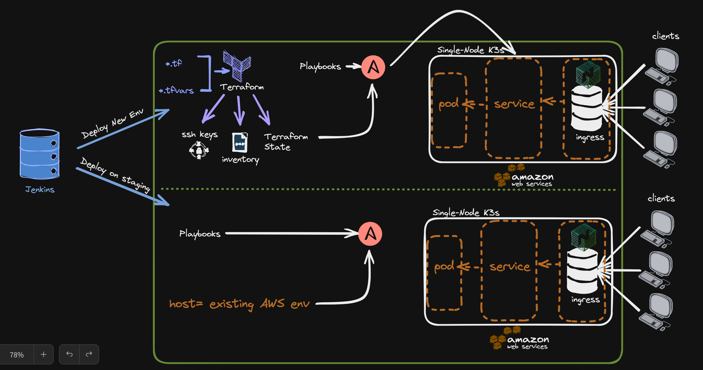

# Oosto-Home-Challange

This Deployment pipeline is deploying a simple site behind an nginx proxy that knows to return a string from a specific url path
The pipeline can get deploy the infrastructure in two ways, distinguished by a flag:
1. REBUILD-CLUSTER=true

    terraform will create a remote server on aws with the AWS modules
    1. Will install all prerequisites
    2. will setup k3s cluster
    3. will setup helm + the nginx ingrees to take requests from the world (see attached architecture)

2. REBUILD-CLUSTER=false
    The deployment will made to an existing envoirnmet that was pre-configured (with public-private-keys-access)

# steps I went through to accomplish this task:

 1. Designed an high-level architecture of the pipeline
 2. Designed a deatiled architecture of the pod-service-ingress mechanism
 1. installing Jenkins 
 1. install needed plugins --  'Terraform' | 'aws' | 'Ansible' |  'jobDSL' | 'SMTP'
 1. configured jenkins seed to get repo changes
 1. install prerequisites on the jenkins instance 
 1. configures access to all users (default / jenkins) 
 1. wrote the pipeline DSL / groovy  
 1. wrote the ansible roles / templates 
 1. wrote tests to verify i indeed gets the correct string in the pipeline 
 9 wrote tests to verify i indeed gets the correct string in the pipeline 
 1. wrote tests to verify i indeed gets the correct string in the pipeline 
 1. considering security - stricting the aws instance inbound rules, not to expose the ingress to the outside world